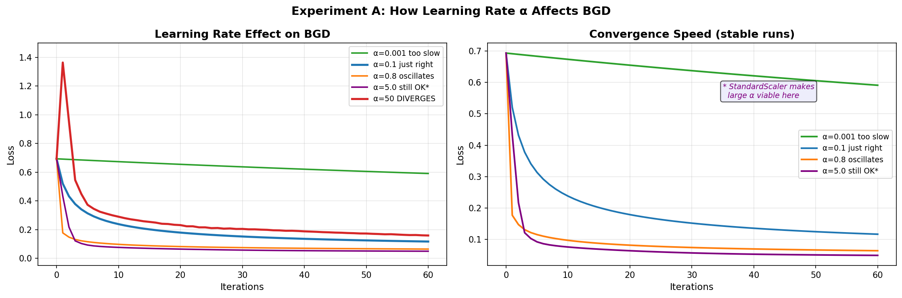
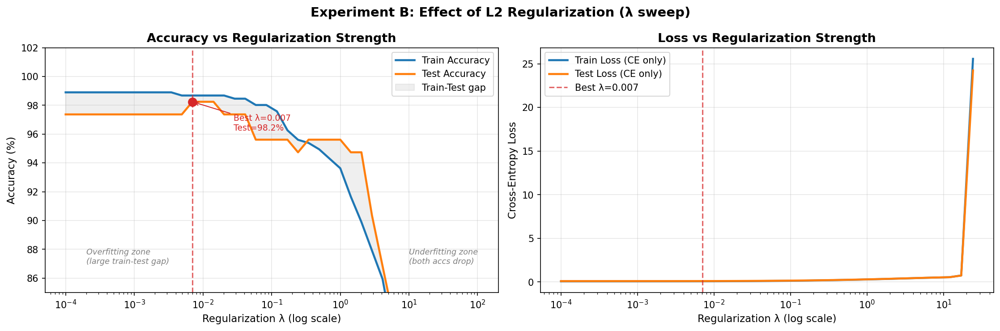
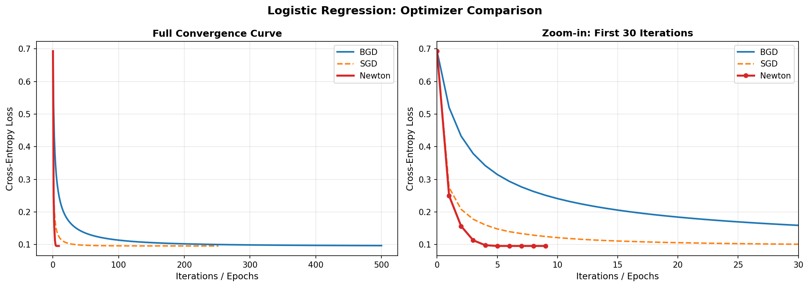
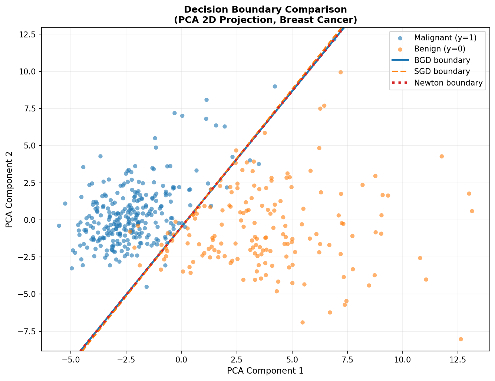
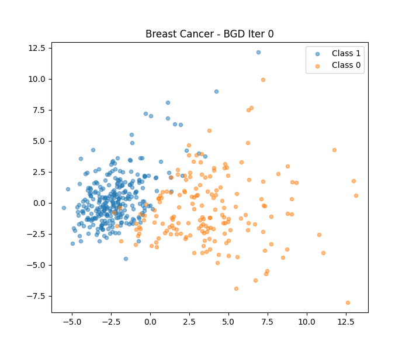
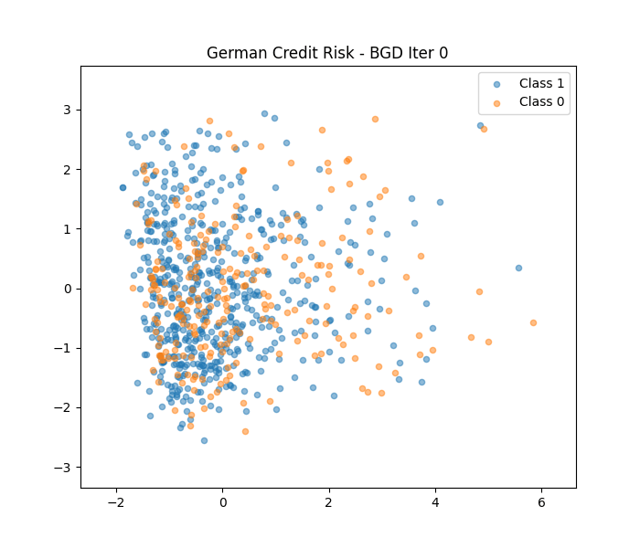
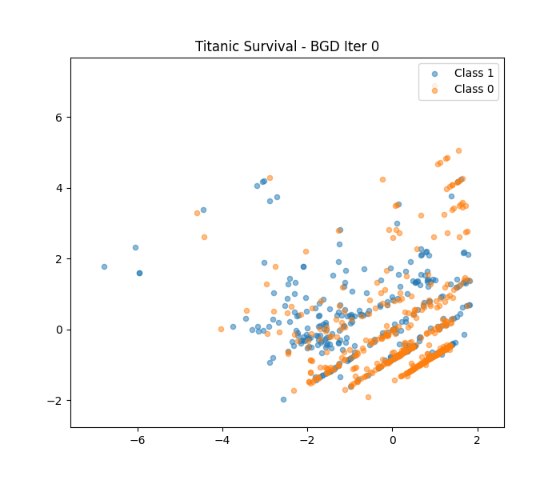

# 逻辑回归：从零手写优化算法


这是南京大学智能科学与技术专业「矩阵计算与优化」课程的实验项目。不调用 sklearn 的 LogisticRegression，从零手写批量梯度下降（BGD）和牛顿法，在乳腺癌数据集上完成二分类任务，并设计了两组对照实验验证理论分析结论。

---

## 实验结果预览

### Experiment A：步长 α 对收敛的影响



步长太小（α=0.001）——60 步之后损失几乎没动；步长太大（α=50）——损失震荡无法收敛。
有意思的是 α=5.0 这么大的步长居然也能稳定收敛，原因是训练前做了 StandardScaler 标准化，损失曲面更「圆」，容忍度更高。

### Experiment B：正则化强度 λ 的影响



横轴用对数坐标，跨越六个数量级才能看到完整行为。三个区域清晰可见：λ 过小轻微过拟合，λ≈0.007 时测试准确率到达峰值 98.2%，λ 过大模型权重被压死、准确率崩塌到 37%。

### 优化算法收敛曲线对比



BGD 线性收敛，牛顿法在前 10 步内完成二次收敛，SGD 波动较大但最终与前两者到达相同最优解，验证了损失函数严格凸的理论性质。

### 决策边界对比（PCA 二维投影）



三种算法的决策边界几乎完全重合，验证了凸优化全局最优解的唯一性。

### 决策边界演化动图

梯度下降在三个真实数据集上的决策边界演化过程：

| Breast Cancer | German Credit Risk | Titanic Survival |
|:---:|:---:|:---:|
|  |  |  |

---

## 项目结构

```
logistic-regression-lab/
├── code/
│   ├── logistic_regression.py              # 核心实现：BGD / SGD / Newton
│   ├── exp_A_learning_rate.py              # 实验 A：步长扫描
│   ├── exp_B_regularization.py             # 实验 B：正则化强度扫描
│   └── logistic_regression_experiments_others.py  # 多数据集验证（组员版）
├── results/
│   ├── exp_A_learning_rate.png
│   ├── exp_B_regularization.png
│   ├── convergence_curve.png
│   ├── decision_boundary.png
│   ├── bgd_evolution_Breast_Cancer.gif
│   ├── bgd_evolution_German_Credit_Risk.gif
│   └── bgd_evolution_Titanic_Survival.gif
├── slides/
│   └── 第4小组-逻辑回归-0520.pptx
└── README.md
```

---

## 核心实现

### 模型与优化

从零实现逻辑回归的全部组件，不依赖 sklearn 的分类器：

```python
def sigmoid(z):
    """数值稳定的 sigmoid，分正负分支计算避免溢出"""
    result = np.zeros_like(z, dtype=float)
    pos = z >= 0
    result[pos] = 1.0 / (1.0 + np.exp(-z[pos]))
    ez = np.exp(z[~pos])
    result[~pos] = ez / (1.0 + ez)
    return result

def gradient(X, y, w, lam):
    """带 L2 正则化的梯度，偏置项不参与正则化"""
    g = (X.T @ (sigmoid(X @ w) - y)) / len(y)
    reg = lam * w.copy()
    reg[0] = 0.0   # 不正则化偏置项
    return g + reg
```

### 工程亮点一：发散早停检测

普通实现跑完全部步数才知道发散，我们每步检查一次，出事立刻停并记录步数，让实验图能精确标注发散位置：

```python
if np.isnan(v) or v > 5:
    losses.append(float('nan'))
    return losses, k + 1    # 返回发散步数

return losses, None         # None = 正常收敛
```

### 工程亮点二：实验设计的严谨性

λ 扫描用对数坐标（线性坐标会把所有细节挤在零附近），评估时剥离正则项（保证不同 λ 之间的公平比较）：

```python
lambdas = np.logspace(-4, 2, 40)   # 对数均匀采样

for lam in lambdas:
    w = bgd(X_train, y_tr, lam=lam)
    # 评估只看纯交叉熵，不带正则项
    train_losses.append(loss(X_train, y_tr, w, lam=0))
    test_losses.append( loss(X_test,  y_te, w, lam=0))
```

---

## 主要结论

1. **步长选择不只取决于 α**，数据标准化会改变损失曲面形状，直接影响步长的容忍上限。
2. **正则化是双刃剑**：λ 太小过拟合，λ 太大欠拟合，最优点只能通过实验确定，理论给不出通用答案。
3. **损失函数严格凸**，BGD 和牛顿法虽然路径不同，最终收敛到相同的全局最优解，三个数据集均验证一致。

---

## 环境依赖

```
numpy
matplotlib
scikit-learn   # 仅用于加载数据集和标准化，分类器从零实现
```

---

*南京大学 · 智能科学与技术 · 矩阵计算与优化实验课 · 2025*
